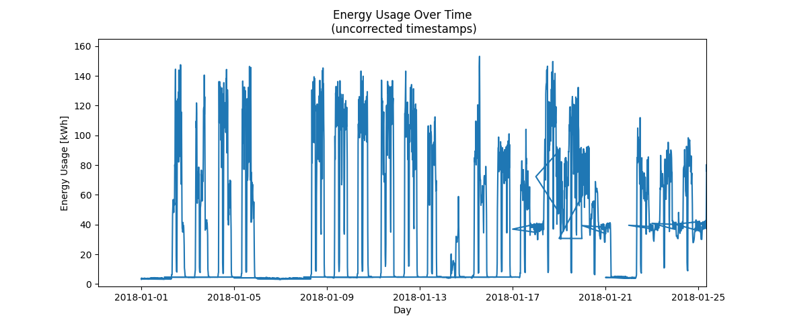
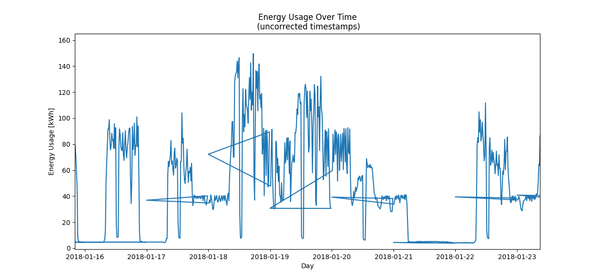
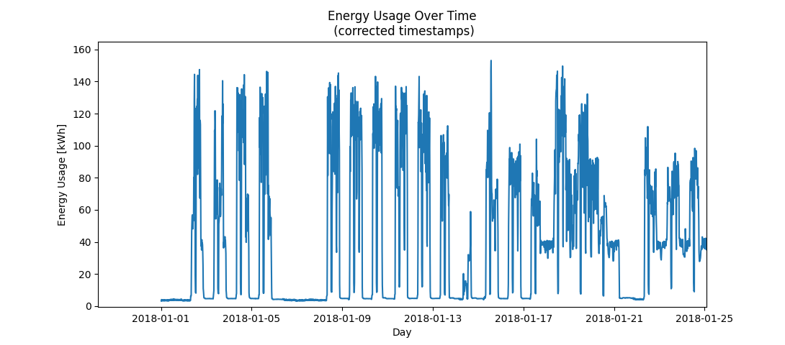
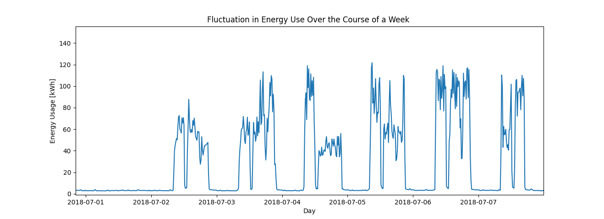
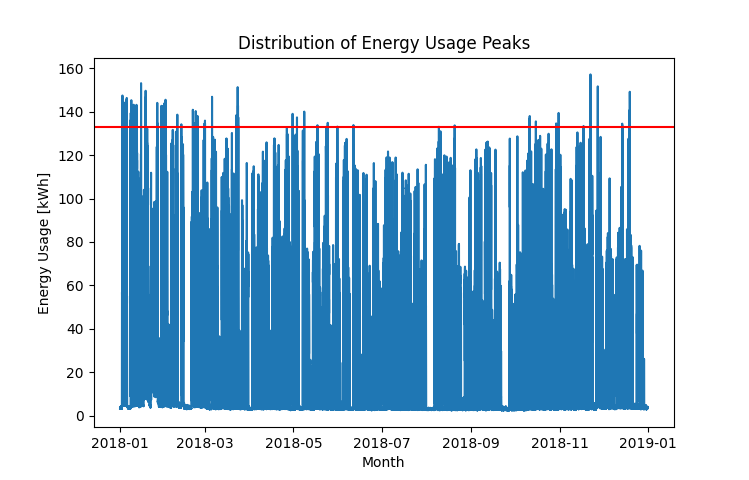
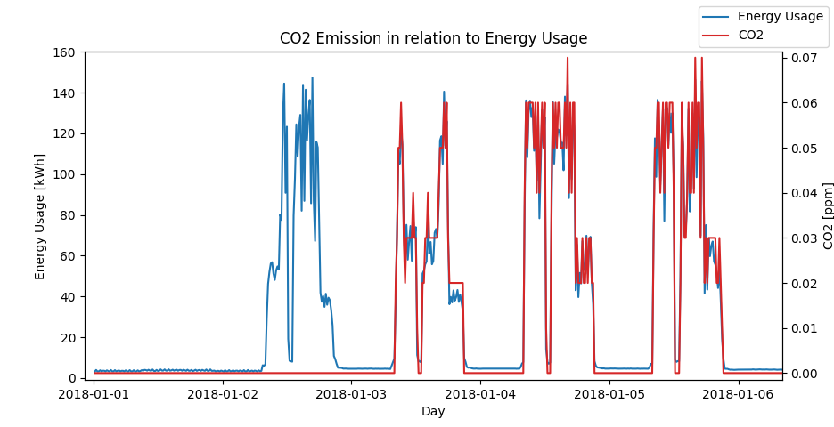
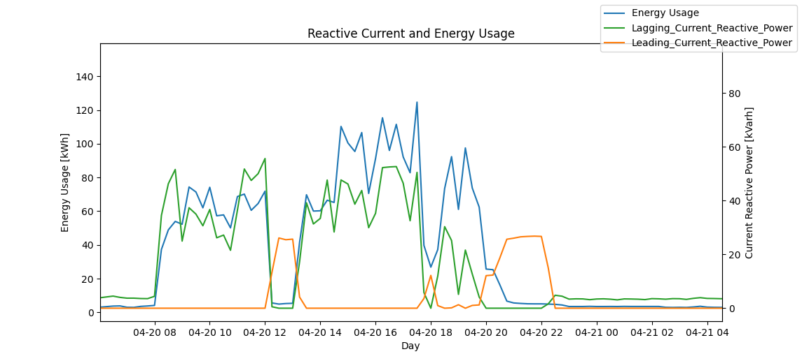

# Documentation of Cleaning a Noisy Dataset

## main.py 
contains the functions used to examine and restructure the dataset

## Transfeld_Handling.pdf
report

## steel_industry_data.csv
dataset

## /images
Examples of visualized data from the report

